# BÁO CÁO ĐỒ ÁN KHOA HỌC DỮ LIỆU

## Đề tài

# PHÂN LOẠI PHƯƠNG TIỆN GIAO THÔNG BẰNG MÔ HÌNH MOBILENETV2 VÀ RESNET50V2

**Học phần:** Khoa học dữ liệu  
**Nhóm học phần:** 23Nh11  
**Năm thực hiện:** 2026  

| Họ tên sinh viên | Mã sinh viên | Nhóm HP | Vai trò chính |
|---|---:|---|---|
| Nguyễn Thanh Hiếu | 102230239 | 23Nh11 | Phụ trách chính phần AI, xây dựng notebook, MobileNetV2, đánh giá mô hình |
| Nguyễn Mạnh Kiên | 102230248 | 23Nh11 | Phụ trách chính phần AI, xây dựng ResNet50V2, xử lý pipeline train/evaluate |
| Nguyễn Văn Tiến | 102230271 | 23Nh11 | Phụ trách chính crawl dữ liệu, kiểm tra nguồn ảnh, hỗ trợ thống kê dữ liệu |
| Huỳnh Ngọc Khánh Linh | 102230196 | 23Nh11 | Phụ trách chính crawl dữ liệu, tổ chức dữ liệu, hỗ trợ lọc thủ công |

**Ghi chú:** Cả nhóm cùng tham gia lọc dữ liệu thủ công, kiểm tra nhãn, tổng hợp kết quả và hoàn thiện báo cáo.

\newpage

# TÓM TẮT

Đồ án xây dựng một pipeline phân loại ảnh phương tiện giao thông. Nhóm tự thu thập ảnh từ Internet, làm sạch dữ liệu, lọc ảnh trùng, chia tập train/validation/test rồi huấn luyện hai mô hình CNN là MobileNetV2 và ResNet50V2.

Tập dữ liệu cuối gồm 10.767 ảnh thuộc 9 nhãn: `bicycle`, `boat`, `bus`, `car`, `helicopter`, `minibus`, `motorcycle`, `train`, `truck`. Ảnh được crawl chủ yếu từ Naver và DuckDuckGo, sau đó được kiểm tra ảnh lỗi, loại ảnh quá nhỏ, chuẩn hóa về JPEG RGB, đổi tên thống nhất, lọc trùng bằng perceptual hashing và rà soát thủ công những ảnh chưa phù hợp.

Hai notebook dùng cùng một bộ dữ liệu, cùng cách chia tập, cùng kích thước ảnh `224x224` và cùng các metric đánh giá. MobileNetV2 đại diện cho hướng mô hình gọn nhẹ, ít tham số; ResNet50V2 đại diện cho hướng mô hình sâu hơn, có khả năng học đặc trưng mạnh hơn. Báo cáo tập trung trình bày quy trình làm dữ liệu, cấu hình huấn luyện, kết quả test set và nhận xét so sánh giữa hai mô hình.

\newpage

# BẢNG PHÂN CÔNG NHIỆM VỤ

| Thành viên | Nhiệm vụ chính | Nhiệm vụ chi tiết | Mức độ hoàn thành |
|---|---|---|---|
| Nguyễn Thanh Hiếu | AI và notebook | Thiết kế pipeline notebook, xây dựng MobileNetV2, cấu hình train, lưu best model, tổng hợp metric | Hoàn thành |
| Nguyễn Mạnh Kiên | AI và đánh giá mô hình | Xây dựng ResNet50V2, xử lý đánh giá test set, confusion matrix, classification report, so sánh mô hình | Hoàn thành |
| Nguyễn Văn Tiến | Thu thập dữ liệu | Tổ chức keyword, chạy crawl, theo dõi tiến độ, kiểm tra nguồn crawl, hỗ trợ làm sạch dữ liệu | Hoàn thành |
| Huỳnh Ngọc Khánh Linh | Thu thập và tổ chức dữ liệu | Hỗ trợ crawl, kiểm tra cấu trúc folder, thống kê dữ liệu, hỗ trợ chuẩn bị dữ liệu upload Kaggle | Hoàn thành |
| Cả nhóm | Lọc dữ liệu và báo cáo | Lọc thủ công ảnh sai nhãn, rà soát ảnh trùng, tổng hợp hình minh họa, viết và chỉnh sửa báo cáo | Hoàn thành |

\newpage

# MỤC LỤC

1. [Giới thiệu](#1-giới-thiệu)  
2. [Thu thập và mô tả dữ liệu](#2-thu-thập-và-mô-tả-dữ-liệu)  
3. [Trích xuất đặc trưng và xử lý dữ liệu](#3-trích-xuất-đặc-trưng-và-xử-lý-dữ-liệu)  
4. [Mô hình hóa dữ liệu](#4-mô-hình-hóa-dữ-liệu)  
5. [Kết luận](#5-kết-luận)  
6. [Tài liệu tham khảo](#6-tài-liệu-tham-khảo)  
7. [Phụ lục](#phụ-lục)  

\newpage

# 1. GIỚI THIỆU

## 1.1. Bối cảnh bài toán

Trong các hệ thống giao thông hiện đại, dữ liệu hình ảnh ngày càng được sử dụng rộng rãi. Camera giao thông, camera tại bãi đỗ xe, camera tại cổng trường, trạm thu phí, nhà ga, bến xe hoặc cảng biển đều tạo ra lượng ảnh và video lớn. Nếu toàn bộ dữ liệu này phải được kiểm tra thủ công, chi phí nhân lực sẽ rất cao, tốc độ xử lý chậm và độ ổn định phụ thuộc nhiều vào người quan sát. Vì vậy, các hệ thống tự động nhận dạng và phân loại phương tiện giao thông có ý nghĩa thực tiễn rõ ràng.

Bài toán của nhóm là phân loại một ảnh đầu vào thành một trong các loại phương tiện giao thông đã định nghĩa. Ảnh có thể chứa nhiều bối cảnh khác nhau như đường phố, bến tàu, nhà ga, bãi đỗ, không trung hoặc môi trường đô thị. Những khác biệt này làm bài toán khó hơn so với một tập dữ liệu được chụp trong điều kiện cố định. Ngoài ra, một số lớp có hình dạng khá giống nhau, ví dụ `car` và `minibus`, `bus` và `minibus`, hoặc `truck` và `bus` trong một số góc chụp. Điều này khiến mô hình cần học được đặc trưng hình dạng tổng quát thay vì chỉ ghi nhớ màu sắc hoặc bối cảnh.

Đồ án không sử dụng các tập dữ liệu có sẵn theo dạng tải trực tiếp, mà yêu cầu sinh viên tự thu thập dữ liệu bằng cách crawl ảnh. Đây là một yêu cầu quan trọng vì chất lượng dữ liệu ảnh thu thập từ Internet thường không đồng đều. Ảnh có thể bị lỗi, kích thước quá nhỏ, trùng lặp, có watermark, có nhiều vật thể khác nhau hoặc sai nhãn. Vì vậy, phần thu thập và làm sạch dữ liệu không chỉ là bước phụ trợ mà là một phần trung tâm của đồ án.

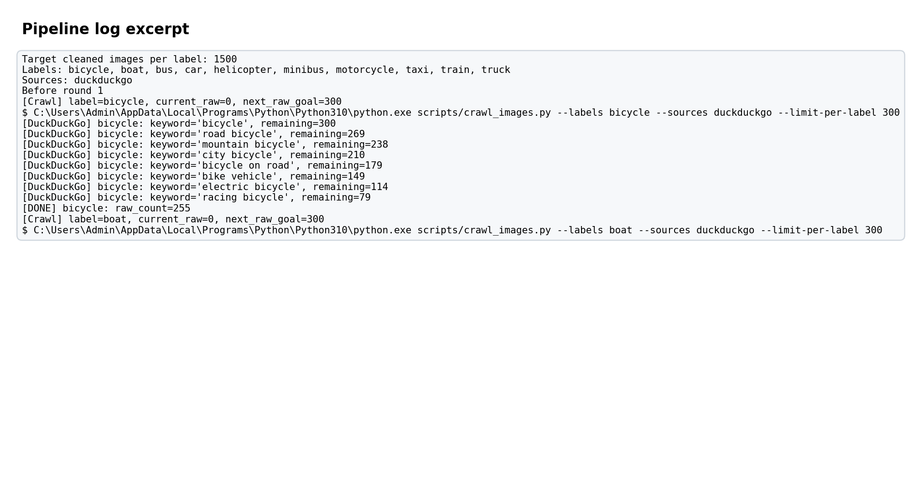

## 1.2. Mục tiêu của đề tài

Đề tài hướng đến việc xây dựng một pipeline hoàn chỉnh cho bài toán phân loại ảnh phương tiện giao thông. Pipeline này bao gồm các giai đoạn chính: thu thập dữ liệu, làm sạch dữ liệu, lọc trùng, thống kê và trực quan hóa dữ liệu, chia tập train/validation/test, tiền xử lý ảnh, trích xuất đặc trưng, huấn luyện hai mô hình học sâu và đánh giá kết quả.

Các mục tiêu cụ thể gồm:

- Thu thập hơn 10.000 ảnh sạch sau khi xử lý.
- Dữ liệu được chia theo 9 nhãn phương tiện giao thông.
- Mỗi nhãn có số lượng ảnh tương đối đủ, tránh mất cân bằng quá nghiêm trọng.
- Có báo cáo thống kê mô tả dữ liệu bằng bảng và biểu đồ.
- Có mô tả quy trình làm sạch dữ liệu và lọc trùng bằng Hamming distance.
- Huấn luyện và đánh giá hai mô hình MobileNetV2 và ResNet50V2.
- Lưu kết quả huấn luyện và đánh giá để phục vụ đối chiếu sau thí nghiệm.
- Đánh giá mô hình bằng Accuracy, Precision, Recall, F1-score và confusion matrix.
- So sánh MobileNetV2 và ResNet50V2 bằng bảng kết quả và biểu đồ.

## 1.3. Danh sách lớp phân loại

Phiên bản thực nghiệm cuối của đề tài sử dụng 9 lớp:

| STT | Label | Mô tả |
|---:|---|---|
| 1 | `bicycle` | Xe đạp, bao gồm xe đạp đường phố, xe đạp thể thao, xe đạp địa hình |
| 2 | `boat` | Thuyền, tàu nhỏ, thuyền máy, thuyền du lịch |
| 3 | `bus` | Xe buýt, xe khách, xe buýt thành phố, xe buýt công cộng |
| 4 | `car` | Ô tô con, sedan, hatchback, SUV, xe gia đình |
| 5 | `helicopter` | Trực thăng dân sự, trực thăng cứu hộ, trực thăng vận tải |
| 6 | `minibus` | Xe buýt nhỏ, shuttle bus, passenger van |
| 7 | `motorcycle` | Xe máy, mô tô, scooter |
| 8 | `train` | Tàu hỏa, tàu điện, đầu tàu, toa tàu |
| 9 | `truck` | Xe tải, xe chở hàng, xe container, xe giao hàng |

Các lớp này được chọn vì vừa phổ biến trong giao thông, vừa có mức độ phân biệt hình dạng khác nhau. Một số lớp có ranh giới rõ ràng như `helicopter` hoặc `boat`, trong khi một số lớp dễ nhầm hơn như `car`, `minibus`, `bus` và `truck`. Nhờ vậy, bài toán đủ đa dạng để đánh giá khả năng học đặc trưng của mô hình.

## 1.4. Tổng quan pipeline dự án

Pipeline tổng thể của nhóm gồm các bước:

1. Tạo danh sách label và keyword crawl.
2. Crawl ảnh từ Naver và DuckDuckGo, có hỗ trợ AutoCrawler.
3. Lưu ảnh thô vào `data/raw/<label>/`.
4. Loại bỏ ảnh lỗi, ảnh quá nhỏ, ảnh không mở được.
5. Chuẩn hóa ảnh về RGB JPEG và đổi tên thống nhất.
6. Lọc ảnh trùng bằng perceptual hashing.
7. Lọc thủ công các ảnh sai nhãn hoặc chất lượng kém.
8. Thống kê dữ liệu bằng CSV và biểu đồ.
9. Upload `data/cleaned` lên Kaggle.
10. Notebook tự chia train/validation/test theo tỉ lệ 70/15/15.
11. Tiền xử lý ảnh: resize 224x224, normalize [0,1], augmentation.
12. Huấn luyện MobileNetV2 và ResNet50V2 với `weights=None`.
13. Đánh giá, trực quan hóa dự đoán đúng/sai và tổng hợp kết quả.

Sơ đồ tổng quan pipeline:

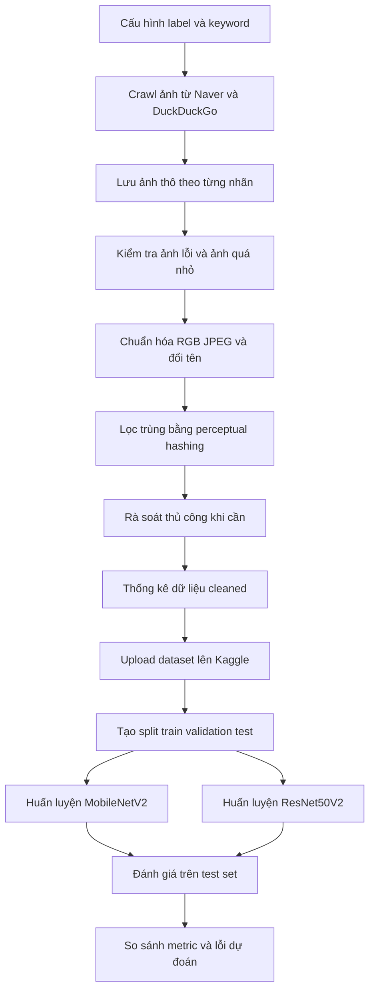
```mermaid
flowchart TB
    A["Cấu hình label và keyword"] --> B["Crawl ảnh từ Naver và DuckDuckGo"]
    B --> C["Lưu ảnh thô theo từng nhãn"]
    C --> D["Kiểm tra ảnh lỗi và ảnh quá nhỏ"]
    D --> E["Chuẩn hóa RGB JPEG và đổi tên"]
    E --> F["Lọc trùng bằng perceptual hashing"]
    F --> G["Rà soát thủ công khi cần"]
    G --> H["Thống kê dữ liệu cleaned"]
    H --> I["Upload dataset lên Kaggle"]
    I --> J["Tạo split train validation test"]
    J --> K["Huấn luyện MobileNetV2"]
    J --> L["Huấn luyện ResNet50V2"]
    K --> M["Đánh giá trên test set"]
    L --> M
    M --> N["So sánh metric và lỗi dự đoán"]
```

\newpage

# 2. THU THẬP VÀ MÔ TẢ DỮ LIỆU

## 2.1. Cấu trúc dữ liệu của project

Dữ liệu được tổ chức theo cấu trúc thư mục chuẩn của bài toán image classification:

```text
traffic_vehicle_classification/
├── data/
│   ├── raw/
│   │   ├── bicycle/
│   │   ├── boat/
│   │   ├── bus/
│   │   ├── car/
│   │   ├── helicopter/
│   │   ├── minibus/
│   │   ├── motorcycle/
│   │   ├── train/
│   │   └── truck/
│   ├── cleaned/
│   ├── duplicates/
│   ├── rejected/
│   └── splits/
├── notebooks/
├── scripts/
├── configs/
└── reports/
```

Thư mục `data/raw` chứa ảnh tải trực tiếp từ Internet. Đây là dữ liệu chưa được xử lý, có thể chứa ảnh lỗi, ảnh trùng, ảnh sai nhãn hoặc ảnh có độ phân giải thấp. Thư mục `data/cleaned` chứa dữ liệu đã qua bước làm sạch tự động và lọc trùng. Đây là thư mục chính được dùng để upload lên Kaggle. Thư mục `data/duplicates` lưu một phần ảnh trùng để phục vụ báo cáo. Thư mục `data/rejected` lưu ảnh bị loại trong quá trình review thủ công.

Việc chia thư mục theo từng label giúp notebook hoặc thư viện TensorFlow/Keras tự nhận diện nhãn dựa trên tên folder. Đây cũng là cấu trúc tương thích với nhiều công cụ xử lý ảnh phổ biến.

## 2.2. Nguồn dữ liệu và công cụ crawl

Nhóm sử dụng phương pháp tự crawl dữ liệu từ Internet. Các nguồn chính gồm:

- Naver Images thông qua AutoCrawler.
- DuckDuckGo Images thông qua package `ddgs`.
- Google Images được thử nghiệm nhưng không dùng làm nguồn chính do gặp CAPTCHA trong quá trình crawl.

AutoCrawler là repository hỗ trợ crawl ảnh từ các nguồn như Google và Naver. Tuy nhiên, khi chạy thực tế, Google có cơ chế chặn tự động bằng CAPTCHA, làm pipeline không ổn định. Vì vậy, nhóm điều chỉnh pipeline để ưu tiên Naver và DuckDuckGo. DuckDuckGo được dùng như nguồn fallback hoặc nguồn bổ sung khi số lượng ảnh của một label chưa đủ.

Thông tin cấu hình crawl được đặt trong `configs/labels.yaml`, gồm danh sách label, keyword cho từng label, nguồn crawl, số ảnh mục tiêu, ngưỡng kích thước ảnh và cấu hình lọc trùng. Cách tổ chức này giúp pipeline dễ tái chạy, dễ thay đổi keyword và dễ chứng minh quy trình thu thập dữ liệu trong báo cáo.

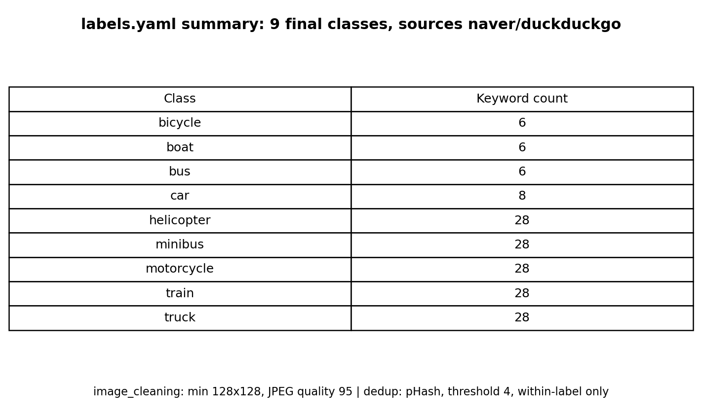

## 2.3. Chiến lược keyword

Mỗi label không chỉ dùng một keyword duy nhất. Nếu chỉ crawl bằng keyword như `car` hoặc `bus`, dữ liệu có thể bị trùng nhiều, góc chụp nghèo nàn và dễ chứa ảnh minh họa không thực tế. Vì vậy, nhóm mở rộng keyword theo nhiều hướng:

- Từ khóa tổng quát: `car`, `bus`, `truck`.
- Từ khóa theo bối cảnh: `car on road`, `bus in traffic`, `boat on water`.
- Từ khóa theo góc nhìn: `side view`, `front view`, `street photo`.
- Từ khóa theo biến thể: `electric car`, `school bus`, `cargo truck`, `rescue helicopter`.
- Từ khóa nhấn mạnh ảnh thật: `real car`, `vehicle photo`, `outdoor`.

Ví dụ với label `car`, các keyword gồm `car`, `sedan car`, `road car`, `vehicle car`, `family car`, `hatchback car`, `car on street`, `car side view`, `car in traffic`, `electric car`, `parked car`, `modern car`. Với label `bus`, các keyword gồm `city bus`, `public bus`, `coach bus`, `school bus`, `transit bus`, `double decker bus`, `airport bus`, `tour bus`, `bus terminal`.

Việc đa dạng keyword giúp dữ liệu có nhiều bối cảnh hơn và giảm tỷ lệ ảnh trùng. Đây là một kinh nghiệm quan trọng trong quá trình crawl ảnh thực tế.

## 2.4. Quy trình crawl dữ liệu

Quy trình crawl được xây dựng bằng script `crawl_images.py`. Script đọc file cấu hình YAML, lấy danh sách label và keyword, sau đó chạy crawl theo từng label. Ảnh sau khi tải về được gom vào đúng thư mục `data/raw/<label>/`. Mỗi ảnh được ghi metadata gồm label, keyword, source, đường dẫn file và thời điểm crawl.

Pipeline crawl có thêm cơ chế chỉ tập trung vào label còn thiếu dữ liệu. Khi một label đã gần đủ số lượng ảnh sạch, pipeline không tiếp tục crawl label đó nữa. Điều này giúp giảm mất cân bằng dữ liệu và tiết kiệm thời gian crawl. Trong quá trình chạy, nhóm nhận thấy có hiện tượng ảnh trùng tăng mạnh nếu lặp lại cùng keyword quá nhiều lần, vì vậy keyword được mở rộng và có chiến lược shuffle/rotate để tăng đa dạng.

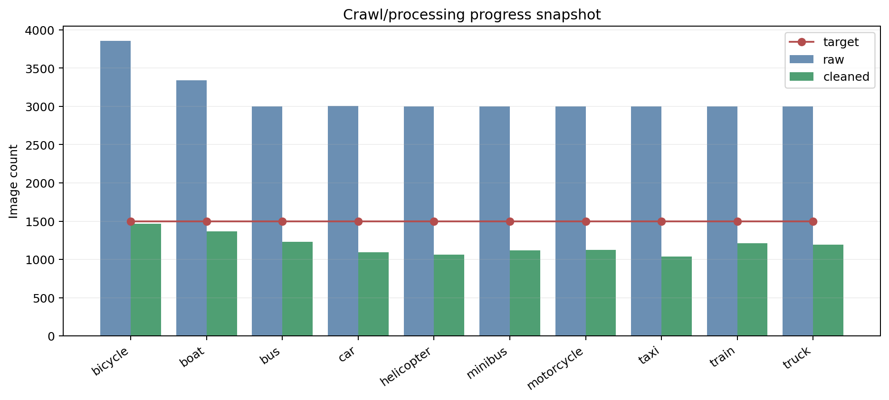

## 2.5. Làm sạch dữ liệu

Ảnh crawl từ Internet có chất lượng không đồng nhất. Một số ảnh có thể bị lỗi khi tải về, ảnh không mở được, ảnh có kích thước quá nhỏ, ảnh grayscale, ảnh có alpha channel hoặc ảnh không phải đối tượng phương tiện. Do đó, bước làm sạch dữ liệu là bắt buộc.

Script `remove_corrupted_images.py` thực hiện các thao tác:

- Mở ảnh bằng Pillow để kiểm tra ảnh có đọc được hay không.
- Loại ảnh lỗi hoặc ảnh không decode được.
- Loại ảnh có kích thước nhỏ hơn `128x128`.
- Chuyển ảnh sang RGB.
- Lưu lại dưới định dạng JPEG.
- Đổi tên theo dạng `label_000001.jpg`, `label_000002.jpg`.
- Lưu ảnh sạch vào `data/cleaned/<label>/`.

Quy trình này giúp dữ liệu đầu vào của mô hình đồng nhất hơn. Việc đổi tên ảnh cũng giúp quản lý dữ liệu dễ hơn, tránh phụ thuộc vào tên file tải từ Internet vốn thường dài, chứa ký tự đặc biệt hoặc không có ý nghĩa.

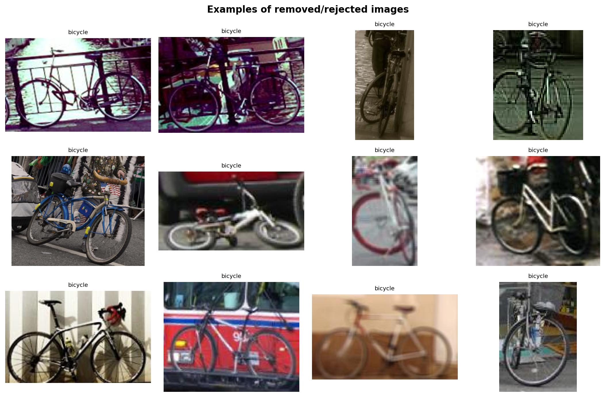

## 2.6. Lọc ảnh trùng bằng perceptual hashing

Một vấn đề lớn khi crawl ảnh là trùng lặp. Nhiều nguồn tìm kiếm trả về cùng một ảnh hoặc các phiên bản gần giống nhau với kích thước khác nhau. Nếu không lọc, mô hình có thể học thuộc ảnh thay vì học đặc trưng tổng quát. Ngoài ra, ảnh trùng giữa train và test có thể làm kết quả đánh giá bị ảo.

Nhóm dùng perceptual hashing, cụ thể là pHash hoặc dHash. Khác với hash truyền thống như MD5, perceptual hash cố gắng biểu diễn nội dung thị giác của ảnh. Hai ảnh gần giống nhau thường có hash gần nhau dù kích thước hoặc mức nén khác nhau.

Hamming distance được tính bằng số bit khác nhau giữa hai hash. Nếu khoảng cách Hamming nhỏ hơn hoặc bằng ngưỡng cấu hình, hai ảnh được xem là trùng hoặc gần trùng. Trong pipeline hiện tại, nhóm dùng:

- Hash method: `phash`.
- Hamming threshold: `4`.
- Chỉ so sánh trong cùng label: `within_label_only = true`.

Việc chỉ lọc trùng trong cùng label giúp tránh loại nhầm những ảnh có hình dạng giống nhau nhưng thuộc label khác nhau, ví dụ `car` và `minibus`. Đây là lựa chọn an toàn trong bối cảnh các lớp phương tiện có thể có hình dạng tương đồng.

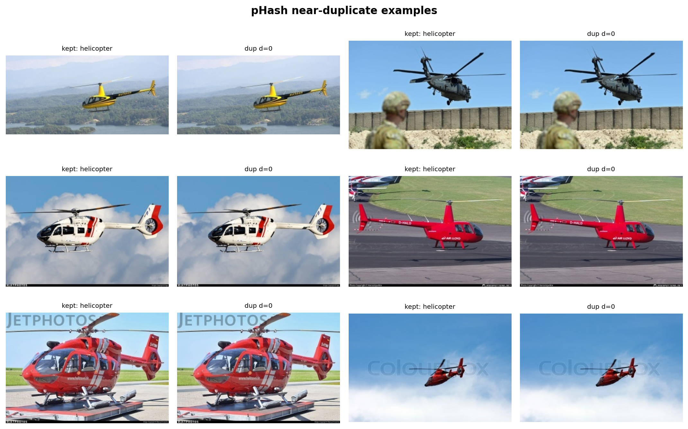

## 2.7. Lọc thủ công

Sau khi làm sạch tự động, dữ liệu vẫn cần lọc thủ công. Lý do là thuật toán không thể xác định chắc chắn ảnh có đúng nhãn hay không. Ví dụ, keyword `train` có thể trả về ga tàu hoặc đường ray không có tàu. Keyword `boat` có thể trả về ảnh phong cảnh biển có thuyền rất nhỏ. Keyword `bus` có thể trả về nội thất xe hoặc biển báo không phù hợp.

Nhóm sử dụng cơ chế review thủ công bằng grid ảnh. Ảnh được hiển thị theo từng label để thành viên kiểm tra nhanh. Các ảnh sai nhãn, ảnh có đối tượng quá nhỏ, ảnh bị che khuất hoặc ảnh không phù hợp sẽ được chuyển sang `data/rejected/<label>/`. Cả nhóm cùng tham gia bước này để giảm sai sót chủ quan.

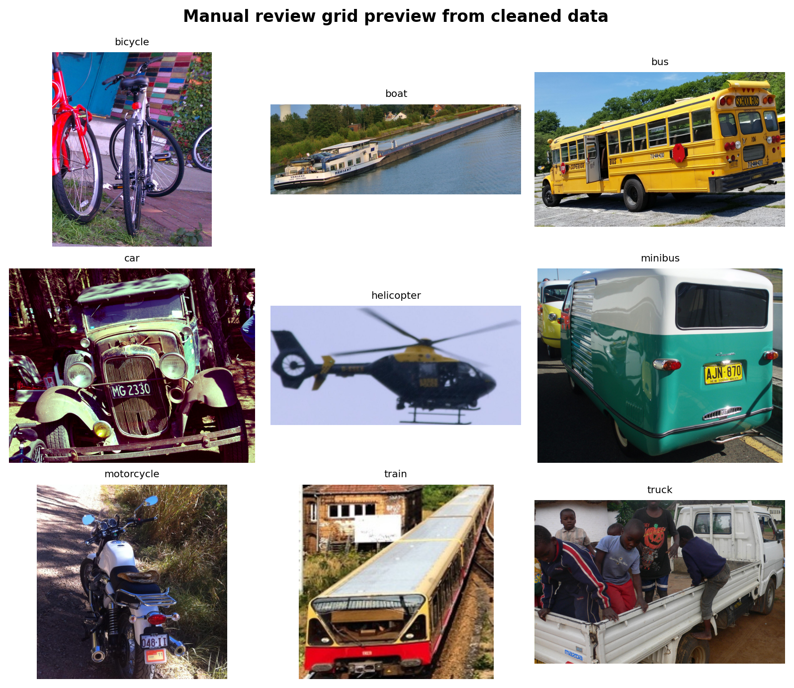

## 2.8. Thống kê dữ liệu sau làm sạch

Sau quá trình crawl, làm sạch, lọc trùng và cân bằng dữ liệu, tập `data/cleaned` hiện có tổng cộng **10.767 ảnh**. Đây là số lượng vẫn thỏa yêu cầu hơn 10.000 mẫu. Bảng sau trình bày số lượng ảnh theo từng label sau khi cân bằng:

| Label | Số ảnh |
|---|---:|
| bicycle | 1200 |
| boat | 1200 |
| bus | 1200 |
| car | 1200 |
| helicopter | 1167 |
| minibus | 1200 |
| motorcycle | 1200 |
| train | 1200 |
| truck | 1200 |

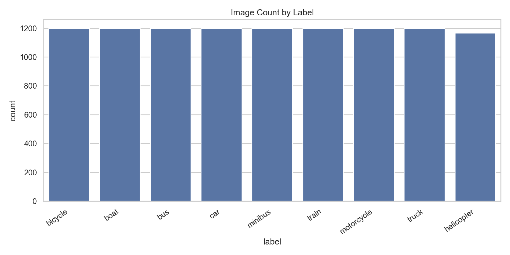

Nhìn chung, dữ liệu sau cân bằng có phân bố khá đều (hầu hết các lớp ở mức 1200 ảnh). Lớp `helicopter` giữ mức 1167 ảnh do số lượng ảnh hợp lệ ban đầu thấp hơn các lớp khác, nhưng vẫn đủ lớn để huấn luyện. Notebook sử dụng stratified split để giữ phân bố class ổn định giữa train, validation và test.

## 2.9. Phân tích chi tiết về dữ liệu crawl

### 2.9.1. Vì sao dữ liệu crawl cần được kiểm soát chặt?

Dữ liệu crawl từ Internet khác với dữ liệu benchmark đã được chuẩn hóa. Trong một benchmark phổ biến, ảnh thường đã được kiểm duyệt, nhãn đã được xác nhận, định dạng ảnh tương đối ổn định và phân bố class có thể đã được thiết kế trước. Ngược lại, dữ liệu crawl bằng công cụ tìm kiếm ảnh thường phản ánh cách công cụ tìm kiếm hiểu keyword, không phản ánh hoàn toàn ý định của người xây dựng dataset. Ví dụ, keyword `bus` có thể trả về ảnh xe buýt thật, ảnh đồ chơi xe buýt, icon xe buýt, biển báo trạm xe buýt, ảnh bên trong xe buýt hoặc poster quảng cáo. Keyword `helicopter` có thể trả về ảnh trực thăng thật, mô hình đồ chơi, ảnh hoạt hình, biểu tượng vector hoặc ảnh có trực thăng rất nhỏ ở xa.

Vì vậy, quá trình crawl cần được xem là bước tạo dữ liệu thô, chưa phải dữ liệu huấn luyện cuối cùng. Nếu đưa trực tiếp toàn bộ ảnh raw vào train, mô hình có thể học các đặc trưng sai. Chẳng hạn, nếu nhiều ảnh `bus` có chữ quảng cáo lớn ở nền, mô hình có thể dựa vào chữ thay vì học hình dạng xe. Nếu nhiều ảnh `boat` là ảnh phong cảnh biển với thuyền nhỏ, mô hình có thể học nền nước thay vì học hình dạng thuyền. Những lỗi này làm mô hình có vẻ tốt trên test set nội bộ nhưng kém khi gặp ảnh thực tế.

Trong đồ án, nhóm xử lý vấn đề này bằng nhiều tầng kiểm soát. Tầng thứ nhất là mở rộng keyword để giảm thiên lệch do một keyword đơn lẻ. Tầng thứ hai là làm sạch tự động để loại ảnh lỗi và ảnh quá nhỏ. Tầng thứ ba là lọc trùng bằng perceptual hash để tránh lặp lại nhiều ảnh giống nhau. Tầng cuối cùng là lọc thủ công để kiểm tra nhãn và chất lượng hình ảnh.

### 2.9.2. Lý do giữ lại một phần ảnh duplicate cho báo cáo

Ban đầu, thư mục duplicate có số lượng rất lớn vì cùng một keyword được crawl nhiều lần và một số nguồn trả về ảnh giống nhau. Sau khi phát hiện vấn đề này, nhóm thay đổi chiến lược keyword và cấu hình dedup. Tuy nhiên, nhóm không xóa toàn bộ duplicate mà giữ lại một số mẫu đại diện. Việc giữ mẫu duplicate có hai lợi ích.

Thứ nhất, nó giúp minh họa rõ ràng trong báo cáo rằng dữ liệu crawl thật sự có vấn đề trùng lặp và nhóm đã xử lý vấn đề đó. Nếu chỉ mô tả bằng chữ, người đọc khó hình dung mức độ trùng ảnh. Khi có hình minh họa các ảnh gần giống nhau, phần giải thích về pHash, dHash và Hamming distance sẽ thuyết phục hơn.

Thứ hai, nó giúp nhóm có bằng chứng quy trình. Một báo cáo khoa học dữ liệu không chỉ trình bày kết quả cuối cùng mà còn cần mô tả các quyết định xử lý dữ liệu. Ảnh duplicate là một ví dụ tốt để chứng minh dữ liệu đã được kiểm tra và xử lý có hệ thống.

### 2.9.3. Tiêu chí lọc thủ công đề xuất

Khi lọc thủ công, nhóm nên thống nhất tiêu chí để tránh mỗi người lọc một kiểu. Một ảnh nên được giữ nếu phương tiện chính thuộc đúng label, vật thể đủ lớn, ảnh không quá mờ và không phải hình minh họa hoặc logo. Một ảnh nên bị loại nếu không có phương tiện, phương tiện quá nhỏ, có nhiều phương tiện thuộc nhiều class khác nhau mà không rõ đối tượng chính, ảnh hoạt hình, ảnh đồ chơi, ảnh render 3D không thực tế hoặc ảnh có watermark quá lớn che mất phương tiện.

Với các class dễ nhầm, cần thêm tiêu chí riêng. Với `minibus`, cần phân biệt với `bus` bằng kích thước và dạng thân xe; nếu xe quá lớn giống bus thành phố thì nên chuyển sang review. Với `truck`, nên giữ ảnh xe tải chở hàng, xe container, delivery truck; không nên giữ ảnh pickup nhỏ nếu dễ gây nhầm với car.

\newpage

# 3. TRÍCH XUẤT ĐẶC TRƯNG VÀ XỬ LÝ DỮ LIỆU

## 3.1. Đặc trưng ảnh được sử dụng

Trong bài toán phân loại ảnh bằng CNN, nhóm không tự thiết kế đặc trưng thủ công như dữ liệu dạng bảng. Mô hình nhận ảnh đã được chuẩn hóa, sau đó các lớp convolution tự học đặc trưng thị giác như cạnh, đường viền, texture, bộ phận phương tiện và hình dáng tổng thể.

Trước khi đưa vào mô hình, dữ liệu vẫn cần một số thông tin mô tả để kiểm tra chất lượng ảnh và tạo pipeline train ổn định:

| Nhóm thông tin | Trường hoặc giá trị | Vai trò trong pipeline |
|---|---|---|
| Định danh mẫu | `image_path`, `label`, `label_id` | Xác định ảnh, nhãn chữ và nhãn số khi tạo dataframe |
| Thống kê ảnh gốc | Width, height, số kênh, file size, aspect ratio | Phân tích dữ liệu, phát hiện ảnh quá nhỏ hoặc bất thường |
| Tensor đầu vào | `224x224x3`, kiểu `float32` | Định dạng ảnh thống nhất để tạo batch huấn luyện |
| Chuẩn hóa pixel | Chia `255.0`, sau đó rescale về `[-1, 1]` trong model | Giúp giá trị đầu vào ổn định hơn khi tối ưu |
| Augmentation | Flip, translation, rotation, zoom, contrast | Tăng đa dạng ảnh train và giảm overfitting |
| Đặc trưng CNN | Cạnh, texture, bộ phận xe, hình dáng tổng thể | Được mô hình tự học từ dữ liệu ảnh |

Các trường như width, height và file size chủ yếu dùng để hiểu dữ liệu và kiểm soát chất lượng. Phần trực tiếp đi vào mô hình là tensor ảnh sau resize, chuẩn hóa và augmentation.

## 3.2. Thống kê kích thước ảnh

Ảnh crawl có kích thước rất đa dạng. Một số ảnh chỉ lớn hơn ngưỡng tối thiểu 128 pixel, trong khi một số ảnh có độ phân giải vài nghìn pixel. Nếu đưa trực tiếp ảnh với kích thước khác nhau vào mô hình, batch training sẽ không thể hoạt động ổn định. Vì vậy, ảnh cần được resize về một kích thước cố định.

Trong notebook, nhóm chọn kích thước `224x224`. Đây là kích thước phổ biến cho nhiều mô hình CNN, bao gồm MobileNetV2 và ResNet50V2. Việc chọn 224x224 là sự cân bằng giữa khả năng giữ thông tin hình ảnh và chi phí tính toán. Ảnh lớn hơn có thể giữ nhiều chi tiết hơn nhưng làm train chậm hơn. Ảnh nhỏ hơn train nhanh hơn nhưng có thể mất chi tiết, đặc biệt với các lớp có hình dạng gần giống nhau.

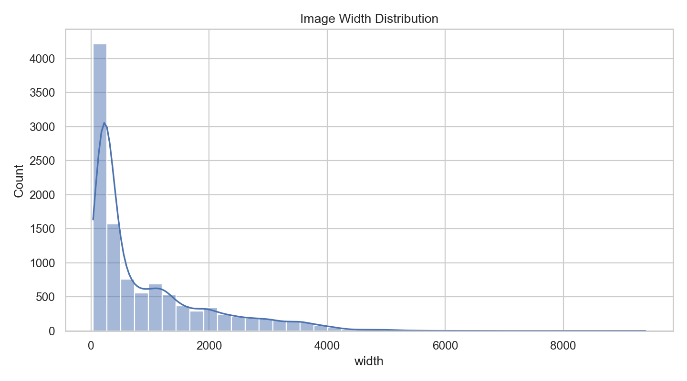

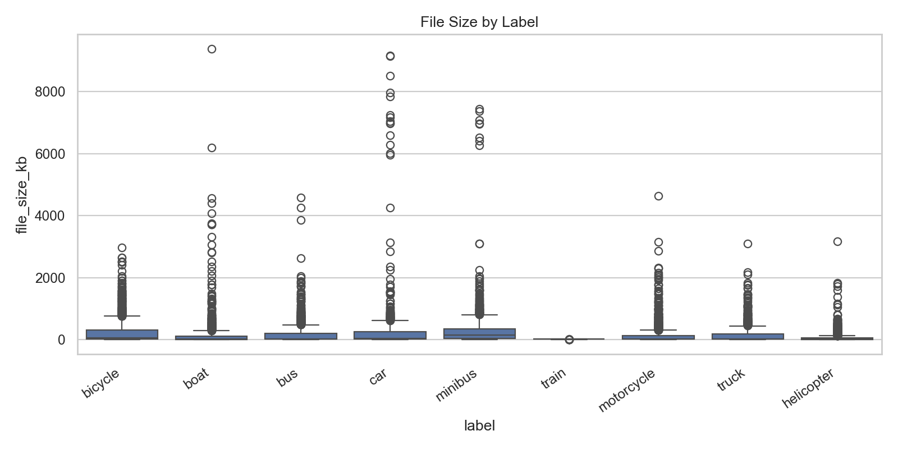

## 3.3. Chuẩn hóa pixel

Ảnh gốc có giá trị pixel trong khoảng 0 đến 255. Trong hai notebook, ảnh được decode bằng TensorFlow, resize về `224x224`, chuyển sang `float32` và chia cho `255.0` trong pipeline `tf.data`, vì vậy batch đầu vào có miền giá trị `[0, 1]`. Bên trong model graph, notebook tiếp tục dùng lớp `Rescaling(2.0, offset=-1.0)` để đưa ảnh về miền `[-1, 1]` trước khi đi qua backbone. Cách tách này giúp phần đọc dữ liệu nhất quán, còn phần chuẩn hóa cuối nằm trực tiếp trong mô hình đã lưu.

Trong pipeline, validation set và test set chỉ được resize và normalize, không augmentation. Train set được áp dụng augmentation để tăng tính đa dạng dữ liệu. Việc tách rõ tiền xử lý giữa train và test giúp đánh giá công bằng hơn, vì test set đại diện cho dữ liệu chưa thấy.

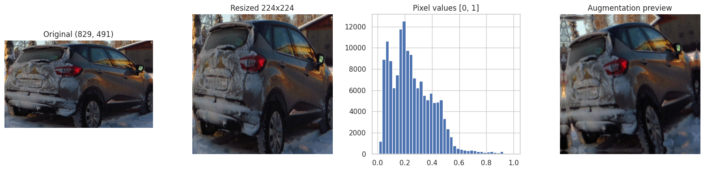

## 3.4. Data augmentation

Dữ liệu cần đủ đa dạng để tránh overfitting. Nhóm sử dụng augmentation trực tiếp trong model graph. Các lớp augmentation chỉ hoạt động khi training, còn khi validation/test hoặc inference thì không làm biến đổi ảnh. Cấu hình augmentation trong notebook gồm:

- Random horizontal flip.
- Random translation `0.06`.
- Random rotation `0.05`.
- Random zoom `0.12`.
- Random contrast `0.12`.

Random flip phù hợp với đa số phương tiện vì xe nhìn từ trái sang phải hoặc phải sang trái vẫn là cùng một lớp. Random rotation nhỏ giúp mô hình chịu được ảnh nghiêng nhẹ. Random zoom giúp mô hình học tốt hơn khi vật thể ở gần hoặc xa. Random contrast giúp mô hình ít phụ thuộc vào điều kiện ánh sáng.

Tuy nhiên, augmentation cần vừa phải. Nếu rotation quá mạnh hoặc zoom quá lớn, ảnh có thể trở nên không thực tế. Với bài toán phương tiện giao thông, vật thể thường có hướng tương đối rõ, nên augmentation cực đoan có thể làm giảm chất lượng học.

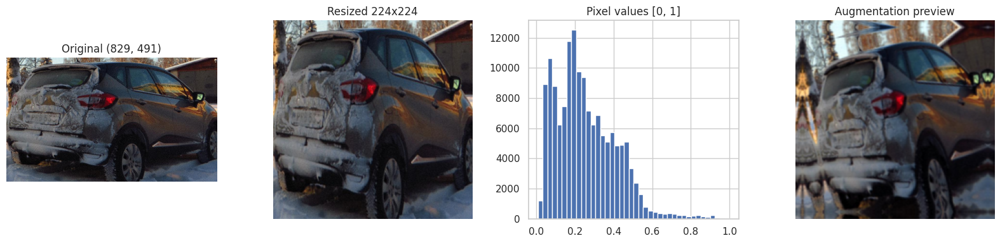

## 3.5. Trực quan hóa PCA/t-SNE trước train

Notebook có phần trực quan hóa đặc trưng bằng PCA hoặc t-SNE. Mục tiêu của bước này không phải để train mô hình chính, mà để hiểu sơ bộ mức độ phân tách của dữ liệu. Có thể dùng pixel feature sau khi resize nhỏ để giảm chiều và vẽ lên mặt phẳng 2D.

Nếu các điểm của từng class tạo thành cụm tương đối riêng, bài toán có khả năng phân loại tốt hơn. Nếu các class trộn lẫn mạnh, mô hình có thể gặp khó khăn, đặc biệt với các lớp tương đồng. Với dữ liệu phương tiện, một số class như `boat` và `helicopter` thường dễ tách hơn vì hình dạng và bối cảnh khác biệt. Ngược lại, `car`, `minibus`, `bus` và `truck` có thể bị trộn lẫn do cùng xuất hiện trên đường và có hình dạng hộp hoặc thân xe tương tự.

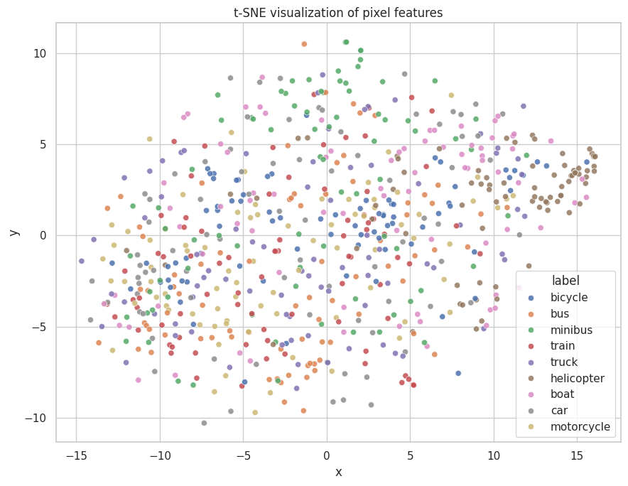

## 3.6. Chia tập train/validation/test

Notebook sử dụng stratified split theo label với tỉ lệ 70/15/15. Stratified split đảm bảo mỗi tập có phân bố class gần giống nhau. Điều này quan trọng vì nếu một class xuất hiện quá ít trong test set, metric đánh giá có thể thiếu ổn định.

Ba tập dữ liệu có vai trò khác nhau:

- Train set: dùng để cập nhật trọng số mô hình.
- Validation set: dùng để theo dõi quá trình train, chọn best model và early stopping.
- Test set: dùng để đánh giá cuối cùng sau khi mô hình đã được chọn.

Trong quá trình huấn luyện chính, notebook đọc trực tiếp dataset Kaggle tại `/kaggle/input/datasets/leighk/vehicle-dataset-ver-2/cleaned` và tạo split bằng `train_test_split(..., stratify=label_id, random_state=42)`. Kết quả split trong hai notebook là `7536` ảnh train, `1615` ảnh validation và `1616` ảnh test. Hầu hết các lớp có `840/180/180` ảnh ở train/validation/test; riêng `helicopter` có `816/175/176` do tổng số ảnh là `1167`.

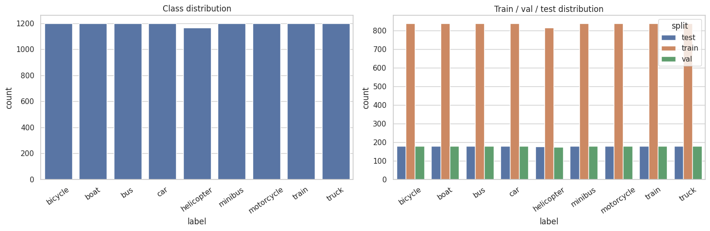

\newpage

# 4. MÔ HÌNH HÓA DỮ LIỆU

## 4.1. Lý do chọn mạng CNN

Convolutional Neural Network là kiến trúc phù hợp với dữ liệu ảnh vì nó khai thác cấu trúc không gian của ảnh. Thay vì xem ảnh như một vector phẳng, CNN dùng kernel trượt qua ảnh để học các pattern cục bộ. Cơ chế convolution giúp mô hình nhận diện cạnh, texture, hình dạng và các bộ phận của vật thể ở nhiều vị trí khác nhau.

Trong bài toán phân loại phương tiện, các đặc trưng quan trọng có thể nằm ở nhiều vùng ảnh: bánh xe, thân xe, kính chắn gió, cửa xe, đầu tàu, cánh quạt trực thăng, buồng lái, đường ray, mặt nước hoặc bối cảnh đường phố. CNN có khả năng kết hợp các đặc trưng cục bộ thành đặc trưng toàn cục để đưa ra nhãn cuối.

## 4.2. Cấu hình huấn luyện

Hai notebook `mobilenet.ipynb` và `resnet50.ipynb` dùng cùng một bộ dữ liệu, cùng cách chia train/validation/test và cùng cơ chế đánh giá. Cách cấu hình này giúp việc so sánh MobileNetV2 và ResNet50V2 công bằng hơn, vì khác biệt chính đến từ kiến trúc mô hình chứ không phải từ cách chuẩn bị dữ liệu hay cách tính metric.

Bảng cấu hình huấn luyện tổng quát:

| Nhóm cấu hình | Giá trị sử dụng | Lý do lựa chọn |
|---|---|---|
| Dataset | `10,767` ảnh, 9 lớp | Đủ vượt yêu cầu dữ liệu và bao phủ nhiều loại phương tiện |
| Split | Train/Validation/Test = `70/15/15`, stratified theo label | Giữ phân bố class tương đối đều giữa các tập |
| Image size | `224x224x3` | Kích thước phổ biến cho MobileNetV2 và ResNet50V2, cân bằng giữa thông tin ảnh và chi phí tính toán |
| Batch size | Global batch size `64` | Tận dụng Kaggle GPU, đồng thời vẫn giữ batch không quá lớn để mô hình học ổn định |
| Pixel pipeline | Decode ảnh, resize, cast `float32`, chia `255.0` | Đưa ảnh về cùng kích thước và cùng miền giá trị `[0, 1]` |
| Model rescale | `Rescaling(2.0, offset=-1.0)` | Đưa pixel về miền `[-1, 1]`, phù hợp với cách tiền xử lý thường dùng trong các kiến trúc CNN này |
| Optimizer | AdamW, learning rate `1e-5`, weight decay `1e-4` | Cập nhật trọng số ổn định và có regularization |
| Loss | Sparse cross entropy + label smoothing `0.05` | Phù hợp bài toán phân loại nhiều lớp và giảm hiện tượng mô hình quá tự tin |
| Max epochs | `80` | Cho mô hình đủ thời gian học, nhưng vẫn có EarlyStopping để dừng khi validation không cải thiện |
| Scheduler | Warmup 5 epoch, sau đó cosine decay | Tăng learning rate từ từ lúc đầu, rồi giảm dần để hội tụ tốt hơn |
| Callback | ModelCheckpoint, EarlyStopping patience `12`, CSVLogger | Lưu mô hình tốt nhất, tránh dùng epoch kém hơn và ghi lại lịch sử huấn luyện |

Luồng xử lý trong mỗi notebook gồm: đọc dataset cleaned trên Kaggle, tạo dataframe `image_path`, `label`, `label_id`, chia stratified split, tạo pipeline `tf.data`, đưa ảnh qua augmentation trong model graph, huấn luyện mô hình, lưu checkpoint tốt nhất theo `val_accuracy`, sau đó đánh giá lại best checkpoint trên test set.

### 4.2.1. Optimizer AdamW

Optimizer được dùng trong hai notebook là AdamW. Đây là biến thể của Adam, trong đó weight decay được tách riêng khỏi bước cập nhật gradient. Adam sử dụng trung bình động của gradient và bình phương gradient để điều chỉnh tốc độ học cho từng tham số. Nhờ đó, quá trình tối ưu thường ổn định hơn so với việc dùng một learning rate giống hệt cho mọi tham số.

AdamW được chọn vì bài toán dùng ảnh crawl có độ đa dạng cao, nhiều bối cảnh và có thể còn nhiễu nhẹ. Nếu cập nhật trọng số quá mạnh, mô hình dễ dao động hoặc học quá sát train set. Learning rate `1e-5` giúp bước cập nhật nhỏ và ổn định hơn. Weight decay `1e-4` đóng vai trò regularization, hạn chế trọng số tăng quá lớn, từ đó giúp mô hình tổng quát hóa tốt hơn trên validation set.

Trong thực nghiệm này, AdamW phù hợp vì cả MobileNetV2 và ResNet50V2 đều có backbone CNN nhiều lớp. Một optimizer thích nghi giúp mô hình học được các đặc trưng ảnh ở nhiều mức khác nhau mà không cần tự điều chỉnh learning rate riêng cho từng lớp.

### 4.2.2. Hàm loss

Hàm loss được dùng là sparse categorical cross entropy kết hợp label smoothing. Đây là lựa chọn phù hợp vì bài toán là phân loại một ảnh vào đúng một trong 9 lớp. Nhãn trong dataframe được lưu dưới dạng số nguyên `label_id`, nên dùng dạng sparse giúp không cần tự chuyển nhãn sang one-hot trong dữ liệu đầu vào.

Công thức cross entropy nhiều lớp:

```latex
L = -\sum_{k=1}^{K} y_k \log(p_k)
```

Trong đó:

- `K` là số lớp, ở đây `K = 9`.
- `y_k` là nhãn thật ở lớp `k`.
- `p_k` là xác suất mô hình dự đoán cho lớp `k` sau softmax.

Khi dùng label smoothing, nhãn one-hot ban đầu được làm mềm thành:

```latex
y'_k = (1 - \varepsilon)y_k + \frac{\varepsilon}{K}
```

Loss khi có label smoothing:

```latex
L = -\sum_{k=1}^{K} y'_k \log(p_k)
```

Với `label_smoothing = 0.05`, nhãn đúng không còn mang xác suất tuyệt đối `1.0`. Điều này giúp mô hình bớt quá tự tin vào một class duy nhất, nhất là khi dữ liệu crawl có thể còn một số ảnh khó, ảnh nhiễu hoặc ảnh có góc chụp không rõ ràng. Lựa chọn này thường giúp validation accuracy ổn định hơn vì mô hình học ranh giới mềm hơn giữa các lớp dễ nhầm như `car`, `minibus`, `bus` và `truck`.

### 4.2.3. Các phương pháp hỗ trợ validation accuracy

Mục tiêu khi cấu hình huấn luyện không chỉ là tăng train accuracy, mà quan trọng hơn là giúp validation accuracy cao và ổn định. Vì validation set đại diện cho dữ liệu chưa dùng để cập nhật trọng số, kết quả trên validation phản ánh khả năng tổng quát hóa của mô hình tốt hơn so với train accuracy.

Nhóm áp dụng các phương pháp sau:

| Phương pháp | Cách dùng trong notebook | Lý do sử dụng |
|---|---|---|
| Stratified split | Chia train/validation/test theo label với seed `42` | Giữ tỷ lệ class ổn định giữa các tập, tránh validation set bị lệch class |
| Data augmentation | Flip, translation, rotation, zoom, contrast trên train set | Tạo thêm biến thể ảnh để mô hình không học thuộc góc chụp hoặc điều kiện ánh sáng cụ thể |
| Dropout | MobileNetV2 dùng `0.40`, ResNet50V2 dùng `0.30` | Giảm phụ thuộc vào một nhóm neuron nhất định, hạn chế overfitting |
| Weight decay | AdamW dùng weight decay `1e-4` | Hạn chế trọng số quá lớn, giúp mô hình tổng quát hóa tốt hơn |
| Warmup learning rate | 5 epoch đầu tăng dần learning rate lên `1e-5` | Tránh cập nhật quá mạnh ở giai đoạn đầu khi trọng số còn chưa ổn định |
| Cosine decay | Sau warmup, learning rate giảm dần theo cosine | Giúp mô hình tinh chỉnh chậm hơn ở các epoch sau, giảm dao động validation accuracy |
| ModelCheckpoint | Lưu model tốt nhất theo `val_accuracy` | Đảm bảo kết quả cuối lấy từ epoch validation tốt nhất, không phụ thuộc epoch cuối |
| EarlyStopping | Dừng nếu `val_accuracy` không cải thiện sau 12 epoch | Tránh train quá lâu khi mô hình bắt đầu chững hoặc có dấu hiệu overfitting |
| Batch size 64 | Dùng global batch size `64` với `MirroredStrategy` | Tận dụng GPU và giữ batch đủ ổn định cho gradient |

`80` epoch được đặt như giới hạn tối đa để mô hình có đủ cơ hội học. Tuy nhiên, hai notebook không ép mô hình chạy đủ 80 epoch. MobileNetV2 dừng sau 44 epoch và ResNet50V2 dừng sau 33 epoch do EarlyStopping. Điều này cho thấy vai trò của callback là chọn điểm dừng hợp lý dựa trên validation accuracy, thay vì chỉ dựa vào số epoch cố định.

Nhìn chung, các kỹ thuật trên cùng hướng đến một mục tiêu: mô hình học được đặc trưng phương tiện đủ tốt trên train set, nhưng vẫn giữ khả năng dự đoán ổn định trên validation set. Đây là lý do nhóm không chỉ quan tâm đến kiến trúc CNN, mà còn cấu hình optimizer, loss, scheduler, callback và augmentation một cách nhất quán giữa hai notebook.

## 4.3. MobileNetV2

MobileNetV2 là kiến trúc CNN nhẹ, phù hợp khi muốn giảm số lượng tham số và chi phí tính toán. So với MobileNet đời đầu, phiên bản V2 cải tiến bằng inverted residual block, linear bottleneck và depthwise separable convolution. Các ý tưởng này giúp mô hình giữ được khả năng biểu diễn đặc trưng trong khi vẫn gọn, phù hợp để kiểm tra hiệu quả của một backbone nhẹ trên bộ dữ liệu tự crawl.

Kiến trúc trong notebook:

| Thành phần | Cấu hình |
|---|---|
| Model name | `MobileNetV2` |
| Input | `224x224x3` |
| Augmentation | Flip, translation `0.06`, rotation `0.05`, zoom `0.12`, contrast `0.12` |
| Rescale | `[-1, 1]` |
| Backbone | `tf.keras.applications.MobileNetV2(include_top=False, weights=None)` |
| Backbone trainable | `True` |
| Pooling | `GlobalAveragePooling2D` |
| Dropout | `0.40` |
| Classifier | `Dense(9, activation='softmax')` |
| Total params | `2,269,513` |
| Trainable params | `2,235,401` |

Sơ đồ tóm tắt kiến trúc MobileNetV2 trong notebook:

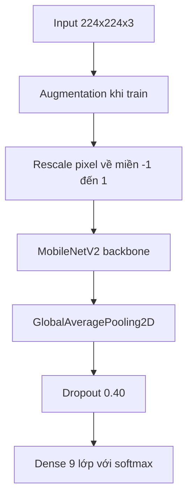
```mermaid
flowchart TD
    A["Input 224x224x3"] --> B["Augmentation khi train"]
    B --> C["Rescale pixel về miền -1 đến 1"]
    C --> D["MobileNetV2 backbone"]
    D --> E["GlobalAveragePooling2D"]
    E --> F["Dropout 0.40"]
    F --> G["Dense 9 lớp với softmax"]
```

## 4.4. ResNet50V2

ResNet50V2 là biến thể ResNet dùng residual connection để giúp mạng sâu tối ưu ổn định hơn. So với ResNet phiên bản đầu, ResNet50V2 sử dụng cách sắp xếp pre-activation, tức Batch Normalization và activation được đặt trước convolution trong residual block. Cách tổ chức này giúp gradient truyền qua mạng sâu mượt hơn, từ đó hỗ trợ học các đặc trưng hình dạng phức tạp. Đổi lại, ResNet50V2 có số tham số lớn hơn đáng kể và thời gian train dài hơn.

Kiến trúc trong notebook:

| Thành phần | Cấu hình |
|---|---|
| Model name | `ResNet50V2` |
| Input | `224x224x3` |
| Augmentation | Flip, translation `0.06`, rotation `0.05`, zoom `0.12`, contrast `0.12` |
| Rescale | `[-1, 1]` |
| Backbone | `tf.keras.applications.ResNet50V2(include_top=False, weights=None)` |
| Backbone trainable | `True` |
| Pooling | `GlobalAveragePooling2D` |
| Dropout | `0.30` |
| Classifier | `Dense(9, activation='softmax')` |
| Total params | `23,583,241` |
| Trainable params | `23,492,361` |

Sơ đồ tóm tắt kiến trúc ResNet50V2 trong notebook:

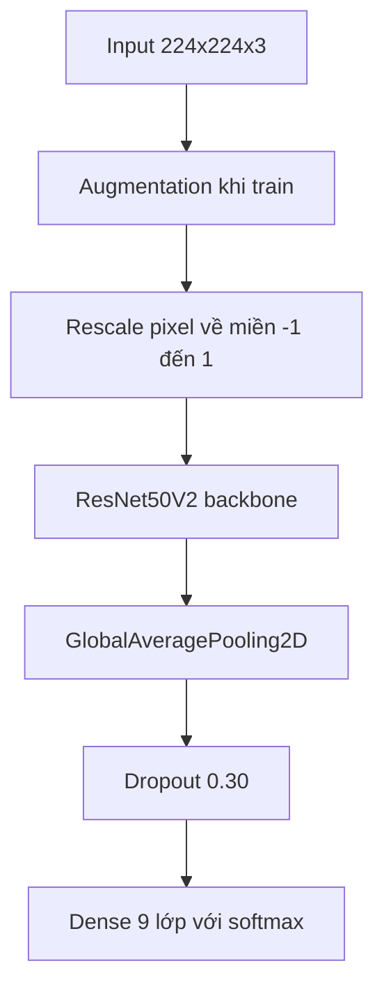
```mermaid
flowchart TD
    A["Input 224x224x3"] --> B["Augmentation khi train"]
    B --> C["Rescale pixel về miền -1 đến 1"]
    C --> D["ResNet50V2 backbone"]
    D --> E["GlobalAveragePooling2D"]
    E --> F["Dropout 0.30"]
    F --> G["Dense 9 lớp với softmax"]
```

## 4.5. Tham số huấn luyện

| Nhóm | Tham số | MobileNetV2 | ResNet50V2 |
|---|---|---:|---:|
| Dữ liệu | Total images | 10,767 | 10,767 |
| Dữ liệu | Train / Val / Test | 7,536 / 1,615 / 1,616 | 7,536 / 1,615 / 1,616 |
| Dữ liệu | Image size | 224x224 | 224x224 |
| Dữ liệu | Global batch size | 64 | 64 |
| Model | Weights | `None` | `None` |
| Model | Trainable backbone | `True` | `True` |
| Huấn luyện | Max epochs | 80 | 80 |
| Huấn luyện | Epoch đã chạy | 44 | 33 |
| Huấn luyện | Optimizer | AdamW | AdamW |
| Huấn luyện | Learning rate | `1e-5` | `1e-5` |
| Huấn luyện | Weight decay | `1e-4` | `1e-4` |
| Huấn luyện | Loss | Sparse CE + label smoothing 0.05 | Sparse CE + label smoothing 0.05 |
| Scheduler | Warmup | 5 epochs | 5 epochs |
| Scheduler | Cosine min factor | 0.01 | 0.01 |
| Callback | Checkpoint monitor | `val_accuracy` | `val_accuracy` |
| Callback | Early stopping patience | 12 | 12 |

Các thông số trên cho thấy hai notebook được giữ tương đối công bằng: cùng dữ liệu, cùng split, cùng optimizer, cùng scheduler và cùng tiêu chí chọn best checkpoint. Sự khác biệt chính nằm ở backbone, dropout, số tham số và thời gian train.

## 4.6. Kết quả train MobileNetV2

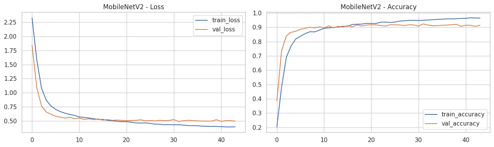

| Metric | Giá trị |
|---|---:|
| Best validation accuracy | 0.9238 tại epoch 32 |
| Test accuracy | 0.9152 |
| Macro precision | 0.9164 |
| Macro recall | 0.9154 |
| Macro F1-score | 0.9153 |
| Number of parameters | 2,269,513 |
| Training time | 1,177.9 giây (19.6 phút) |

MobileNetV2 đạt macro F1 `0.9153` trên test set. Đây là kết quả tốt đối với một mô hình nhẹ trên dữ liệu crawl của nhóm. Các lớp dễ nhận diện như `helicopter`, `bicycle`, `boat`, `motorcycle` và `train` đạt F1 cao. Các lớp khó hơn là `car`, `minibus`, `truck` do hình dạng gần nhau và thường xuất hiện trong bối cảnh đường phố tương tự.

## 4.7. Kết quả train ResNet50V2

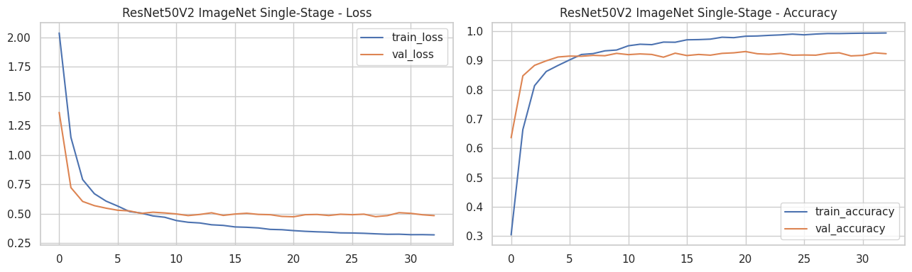

| Metric | Giá trị |
|---|---:|
| Best validation accuracy | 0.9300 tại epoch 21 |
| Test accuracy | 0.9208 |
| Macro precision | 0.9238 |
| Macro recall | 0.9209 |
| Macro F1-score | 0.9217 |
| Number of parameters | 23,583,241 |
| Training time | 1,567.1 giây (26.1 phút) |

ResNet50V2 đạt macro F1 `0.9217`, cao hơn MobileNetV2 khoảng `0.0064`. Mức tăng này có thật nhưng không lớn so với chi phí tham số: ResNet50V2 có khoảng `10.4` lần số tham số của MobileNetV2 và thời gian train dài hơn khoảng `33%`. Vì vậy, ResNet50V2 là mô hình tốt hơn theo metric test, còn MobileNetV2 là phương án gọn hơn.

## 4.8. Confusion matrix và classification report

Confusion matrix giúp quan sát mô hình nhầm class nào với class nào. Trong bài toán này, lỗi tập trung nhiều ở các nhóm phương tiện đường bộ có hình dạng tương đồng: `car`, `minibus`, `bus` và `truck`.


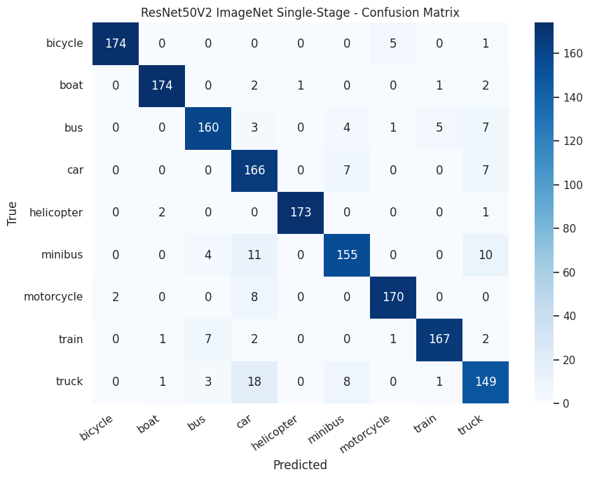

Classification report của MobileNetV2:

| Class | Precision | Recall | F1-score | Support |
|---|---:|---:|---:|---:|
| bicycle | 0.98 | 0.96 | 0.97 | 180 |
| boat | 0.96 | 0.97 | 0.96 | 180 |
| bus | 0.89 | 0.89 | 0.89 | 180 |
| car | 0.81 | 0.87 | 0.84 | 180 |
| helicopter | 0.98 | 0.99 | 0.99 | 176 |
| minibus | 0.83 | 0.88 | 0.85 | 180 |
| motorcycle | 0.95 | 0.96 | 0.95 | 180 |
| train | 0.95 | 0.95 | 0.95 | 180 |
| truck | 0.89 | 0.77 | 0.82 | 180 |

Classification report của ResNet50V2:

| Class | Precision | Recall | F1-score | Support |
|---|---:|---:|---:|---:|
| bicycle | 0.99 | 0.97 | 0.98 | 180 |
| boat | 0.98 | 0.97 | 0.97 | 180 |
| bus | 0.92 | 0.89 | 0.90 | 180 |
| car | 0.79 | 0.92 | 0.85 | 180 |
| helicopter | 0.99 | 0.98 | 0.99 | 176 |
| minibus | 0.89 | 0.86 | 0.88 | 180 |
| motorcycle | 0.96 | 0.94 | 0.95 | 180 |
| train | 0.96 | 0.93 | 0.94 | 180 |
| truck | 0.83 | 0.83 | 0.83 | 180 |

Nhìn vào hai bảng, các lớp `helicopter`, `bicycle`, `boat`, `motorcycle` và `train` có F1-score cao ở cả hai mô hình. Đây là các lớp có hình dáng hoặc bối cảnh khá đặc trưng, nên mô hình dễ học hơn. Nhóm `car`, `minibus`, `bus` và `truck` có F1 thấp hơn vì hình dáng thân xe gần nhau, nhiều ảnh cùng xuất hiện trên đường và một số góc chụp làm mất chi tiết phân biệt.

ResNet50V2 cải thiện rõ nhất ở `minibus` và giữ kết quả tốt hơn một chút ở `bus`, trong khi `car` có recall cao nhưng precision thấp hơn. Điều này cho thấy ResNet50V2 nhận ra nhiều ảnh `car` hơn, nhưng cũng có xu hướng kéo một số ảnh lớp khác về `car`. MobileNetV2 cân bằng hơn về chi phí tính toán, nhưng recall của `truck` thấp hơn, phản ánh việc mô hình nhẹ khó phân biệt nhóm xe tải với các xe đường bộ khác trong một số ảnh.

## 4.9. So sánh MobileNetV2 và ResNet50V2

| Model | Test Accuracy | Macro Precision | Macro Recall | Macro F1-score | Parameters | Training time |
|---|---:|---:|---:|---:|---:|---:|
| MobileNetV2 | 0.9152 | 0.9164 | 0.9154 | 0.9153 | 2,269,513 | 19.6 phút |
| ResNet50V2 | 0.9208 | 0.9238 | 0.9209 | 0.9217 | 23,583,241 | 26.1 phút |

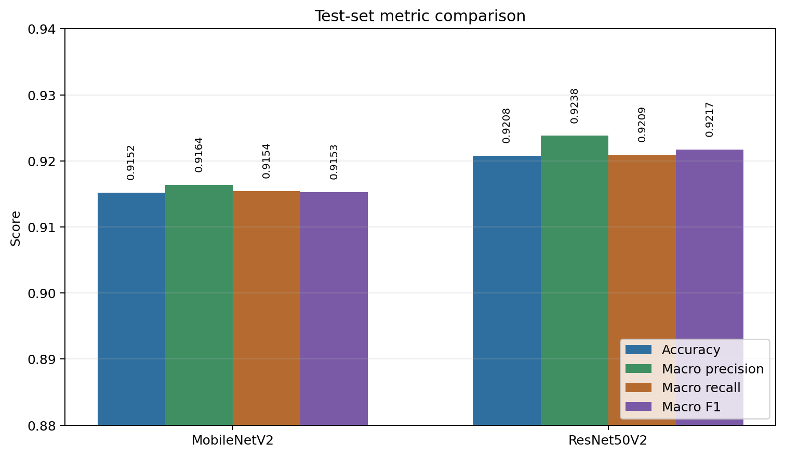

Theo macro F1-score, ResNet50V2 là mô hình tốt hơn trong thí nghiệm này. Tuy nhiên, chênh lệch chỉ khoảng `0.64` điểm phần trăm trong khi số tham số tăng hơn `10` lần. Điều này cho thấy MobileNetV2 là lựa chọn hợp lý nếu ưu tiên mô hình nhẹ, còn ResNet50V2 phù hợp hơn khi ưu tiên accuracy và chấp nhận chi phí tính toán lớn hơn.

Về thực nghiệm, hai mô hình đều vượt mức `0.91` test accuracy, nghĩa là pipeline dữ liệu và cấu hình huấn luyện đã đủ ổn để học được đặc trưng chính của 9 lớp phương tiện. ResNet50V2 thắng nhẹ về metric tổng thể, nhưng MobileNetV2 có lợi thế rõ về kích thước và thời gian train. Nếu dùng trong bài toán cần chạy nhanh hoặc triển khai trên máy cấu hình thấp, MobileNetV2 là lựa chọn hợp lý hơn; nếu mục tiêu chính là tối đa hóa kết quả phân loại trên test set hiện tại, ResNet50V2 là lựa chọn tốt hơn.

## 4.10. Trực quan hóa dự đoán đúng và sai

Notebook lấy 5 ảnh dự đoán đúng cho mỗi label và một nhóm ảnh dự đoán sai có confidence cao. Phần này giúp kiểm tra lỗi theo cách định tính, vì metric tổng hợp không chỉ rõ nguyên nhân mô hình nhầm.

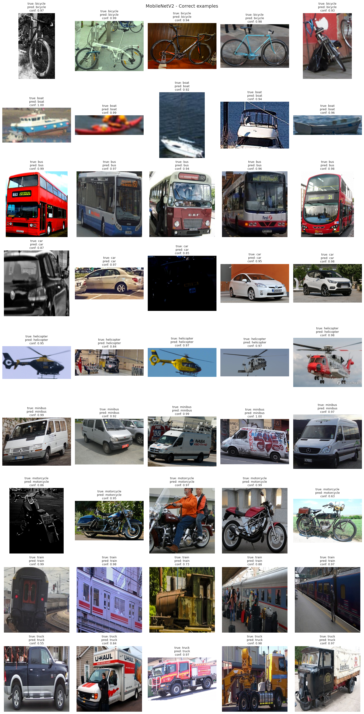

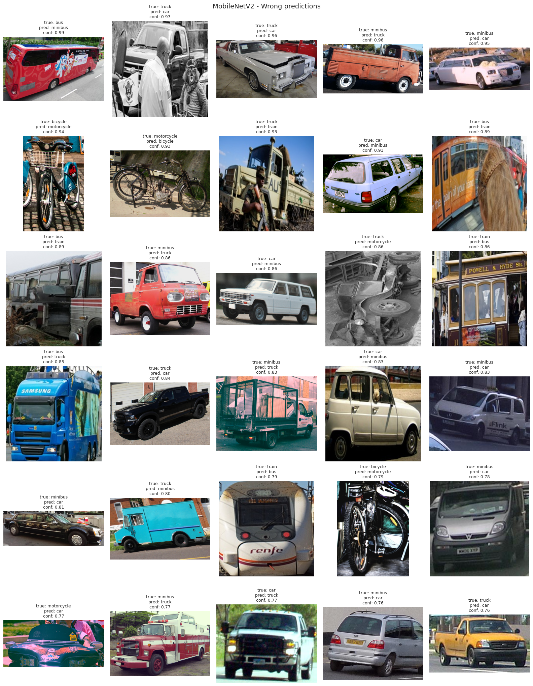

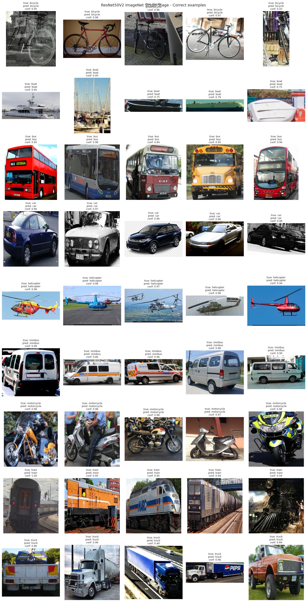

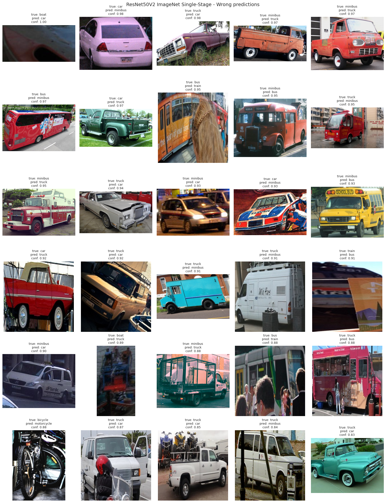

Các lỗi nổi bật của MobileNetV2 gồm `truck -> car` 17 ảnh, `truck -> minibus` 12 ảnh, `car -> minibus` 11 ảnh, `minibus -> truck` 9 ảnh và `bus -> minibus` 8 ảnh. Với ResNet50V2, các lỗi nổi bật gồm `truck -> car` 18 ảnh, `minibus -> car` 11 ảnh, `minibus -> truck` 10 ảnh, `motorcycle -> car` 8 ảnh và `truck -> minibus` 8 ảnh. Các lỗi này phù hợp với quan sát trực quan: xe tải, xe con, minibus và bus có nhiều bối cảnh chung, nhiều ảnh bị chụp ở góc nghiêng hoặc có phần thân xe bị che khuất.

\newpage

# 5. KẾT LUẬN

## 5.1. Kết quả đạt được

Đồ án đã xây dựng được pipeline tương đối hoàn chỉnh cho bài toán phân loại phương tiện giao thông từ ảnh. Nhóm đã tự thu thập dữ liệu bằng crawl ảnh từ Internet, tổ chức dữ liệu theo label, làm sạch dữ liệu, lọc trùng bằng perceptual hashing, thống kê dữ liệu và chuẩn bị notebook Kaggle để huấn luyện MobileNetV2 và ResNet50V2.

Tập dữ liệu cleaned hiện có **10.767 ảnh**, vượt yêu cầu hơn 10.000 mẫu. Dữ liệu gồm 9 class và được tổ chức theo cấu trúc phù hợp với image classification. Hai notebook có đầy đủ các bước: dataset overview, train/validation/test split, preprocessing, feature visualization, xây dựng mô hình, evaluation và trực quan hóa dự đoán đúng/sai.

## 5.2. Hạn chế

Hạn chế lớn nhất của đề tài là dữ liệu crawl từ Internet không đồng đều. Một số ảnh có thể sai nhãn, có nhiều vật thể, có watermark hoặc không tập trung vào phương tiện cần phân loại. Dù đã có lọc tự động và lọc thủ công, dữ liệu vẫn có thể còn nhiễu.

Hạn chế thứ hai là bộ dữ liệu crawl vẫn có độ nhiễu nhất định. Với 10.767 ảnh tự thu thập, kết quả có thể bị ảnh hưởng bởi ảnh sai nhãn, ảnh nhiều vật thể hoặc ảnh có bối cảnh quá khác nhau giữa train và test. Đây là điểm cần được thảo luận rõ trong báo cáo cuối.

Hạn chế thứ ba là vẫn có chênh lệch nhẹ giữa các lớp sau cân bằng: đa số lớp ở mức 1200 ảnh, trong khi `helicopter` ở mức 1167 ảnh. Mức lệch này nhỏ nhưng vẫn có thể ảnh hưởng nhẹ đến precision/recall của từng class.

## 5.3. Hướng cải thiện

Các hướng cải thiện gồm:

- Crawl bổ sung cho các class còn ít như `helicopter`, đồng thời tiếp tục lọc tay để giữ chất lượng nhãn.
- Lọc thủ công kỹ hơn, đặc biệt các ảnh sai nhãn hoặc ảnh có nhiều phương tiện.
- Tăng số epoch và điều chỉnh learning rate schedule.
- Thử optimizer khác như SGD with momentum.
- Tăng augmentation có kiểm soát.
- Cân bằng class bằng oversampling hoặc giới hạn số mẫu mỗi class.
- Thử kiến trúc nhẹ hơn hoặc sâu hơn tùy kết quả ban đầu.
- Thực hiện thêm thí nghiệm với các cấu hình learning rate khác nhau để kiểm tra độ ổn định của kết quả.

## 5.4. Nhận xét cuối

Qua đồ án, nhóm nhận thấy chất lượng dữ liệu có ảnh hưởng rất lớn đến kết quả mô hình. Với dữ liệu crawl, phần khó không chỉ nằm ở huấn luyện mô hình mà còn nằm ở việc thu thập, lọc, chuẩn hóa và kiểm soát chất lượng dữ liệu. MobileNetV2 và ResNet50V2 là hai kiến trúc có triết lý khác nhau: MobileNetV2 tối ưu tính gọn nhẹ, ResNet50V2 tối ưu khả năng học sâu. Việc so sánh hai mô hình giúp nhóm hiểu rõ hơn mối quan hệ giữa kiến trúc, dữ liệu và hiệu quả phân loại.

\newpage

# 6. TÀI LIỆU THAM KHẢO

[1] K. He, X. Zhang, S. Ren, J. Sun, “Deep Residual Learning for Image Recognition,” IEEE Conference on Computer Vision and Pattern Recognition, 2016.  

[2] A. G. Howard et al., “MobileNets: Efficient Convolutional Neural Networks for Mobile Vision Applications,” arXiv preprint, 2017.  

[3] M. Sandler, A. Howard, M. Zhu, A. Zhmoginov, L. Chen, “MobileNetV2: Inverted Residuals and Linear Bottlenecks,” IEEE Conference on Computer Vision and Pattern Recognition, 2018.  

[4] TensorFlow/Keras Documentation, “Keras API reference,” https://keras.io/  

[5] TensorFlow Documentation, “Image classification,” https://www.tensorflow.org/  

[6] Yoongi Kim, “AutoCrawler,” GitHub repository, https://github.com/YoongiKim/AutoCrawler  

[7] Python ImageHash documentation and package information, perceptual image hashing implementation.  

[8] DuckDuckGo search package `ddgs`, Python package for DuckDuckGo search and image retrieval.  

[9] Scikit-learn documentation, metrics, train_test_split, PCA, t-SNE utilities, https://scikit-learn.org/  

\newpage

# PHỤ LỤC

## Phụ lục A. Danh mục hình minh họa trong báo cáo

Các hình minh họa được đánh mã theo nhóm nội dung để dễ đối chiếu giữa báo cáo, notebook và thư mục kết quả thực nghiệm. Bảng sau tổng hợp các nhóm hình chính được sử dụng trong báo cáo.

| Nhóm hình | Mã hình | Nội dung minh họa | Nguồn đối chiếu |
|---|---|---|---|
| Crawl dữ liệu | FIG-CRAWL | Màn hình crawl, cấu hình keyword, log tiến độ | Terminal, `labels.yaml`, `pipeline_progress.csv` |
| Làm sạch dữ liệu | FIG-CLEAN | Ảnh lỗi, ảnh nhỏ, ảnh trùng, giao diện review | `data/rejected`, `data/duplicates`, `manual_review.html` |
| Thống kê dữ liệu | FIG-DATA | Phân bố class, thống kê số lượng mẫu | `dataset_summary.csv`, `reports/figures` |
| Trực quan hóa trước train | FIG-PRETRAIN | Histogram, boxplot, resize, normalize, augmentation, PCA/t-SNE | Notebook Section 4, 7, 8 |
| Chia dữ liệu | FIG-SPLIT | Phân bố train/validation/test | Notebook Section 6 |
| Kiến trúc mô hình | FIG-MODEL | Sơ đồ Mermaid và bảng cấu hình MobileNetV2, ResNet50V2 | Notebook Section 7 |
| Huấn luyện | FIG-TRAIN | Training loss/accuracy của MobileNetV2 và ResNet50V2 | Artifact figures của từng notebook |
| Đánh giá | FIG-EVAL | Confusion matrix và so sánh metric | Classification report, prediction CSV và hình tự tổng hợp từ metric notebook |
| Dự đoán mẫu | FIG-PRED | Ảnh dự đoán đúng/sai của từng mô hình | Notebook Section 11 |

Việc đánh mã hình giúp báo cáo giữ cấu trúc nhất quán. Khi rà soát báo cáo, nhóm chỉ cần kiểm tra từng mã hình đã có caption, đã được nhắc trong nội dung và đã khớp với kết quả thực nghiệm tương ứng.

## Phụ lục B. Các flow Mermaid của dự án

Nhóm xây dựng thêm các flow Mermaid để mô tả pipeline ở mức trực quan. Các flow này hỗ trợ phần trình bày quy trình trong báo cáo và có thể dùng lại trong slide bảo vệ.

| File Mermaid | Nội dung |
|---|---|
| `project_overall_flow.mmd` | Flow tổng quan từ crawl dữ liệu đến đánh giá và so sánh kết quả |
| `crawl_pipeline_flow.mmd` | Flow chi tiết cho bước đọc config, chọn keyword, crawl Naver/DuckDuckGo và lưu metadata |
| `clean_dedup_flow.mmd` | Flow làm sạch ảnh, chuẩn hóa JPEG, tính perceptual hash và lọc duplicate |
| `train_eval_flow.mmd` | Flow từ `data/cleaned` đến split, preprocessing, huấn luyện MobileNetV2/ResNet50V2 và evaluate |
| `kaggle_training_flow.mmd` | Flow chuẩn bị dữ liệu Kaggle, chạy notebook và tổng hợp kết quả |
| `mobilenetv2_architecture_flow.mmd` | Sơ đồ tóm tắt kiến trúc MobileNetV2 trong notebook |
| `resnet50v2_architecture_flow.mmd` | Sơ đồ tóm tắt kiến trúc ResNet50V2 trong notebook |

Các flow này làm rõ tính lặp của pipeline. Đặc biệt, giai đoạn crawl không chạy một lần duy nhất mà được kiểm tra theo số lượng ảnh còn thiếu ở từng label. Giai đoạn làm sạch cũng không chỉ xóa ảnh lỗi, mà còn chuẩn hóa ảnh và tạo dữ liệu đầu vào nhất quán cho quá trình train.

## Phụ lục C. Artifact thực nghiệm

Mỗi notebook lưu artifact vào thư mục riêng trong `/kaggle/working`. Các artifact này giúp nhóm tái kiểm tra mô hình, lấy số liệu đưa vào báo cáo và phân tích dự đoán trên test set.

| Artifact | Ý nghĩa |
|---|---|
| `models/*_best.keras` | Model tốt nhất theo validation accuracy |
| `models/*_final.keras` | Model tại trạng thái cuối sau train |
| `*_history.csv` | Lịch sử loss/accuracy/learning rate |
| `split_dataframe.csv` | Danh sách ảnh và split train/validation/test |
| `label_map.json` | Ánh xạ giữa tên label và id số |
| `*_classification_report.csv` | Báo cáo precision/recall/F1-score theo từng class |
| `*_test_predictions.csv` | Dự đoán của mô hình trên từng ảnh test |
| `*_test_probabilities.npy` | Xác suất dự đoán của mô hình trên test set |
| `*_correct_examples.csv`, `*_wrong_predictions.csv` | Dữ liệu phục vụ phân tích ảnh đúng/sai |

Các file prediction CSV có vai trò quan trọng trong phần phân tích định tính. Từ các file này, nhóm xác định được ảnh nào dự đoán đúng, ảnh nào dự đoán sai, class thật là gì, class dự đoán là gì và độ tự tin của mô hình.

## Phụ lục D. Rà soát nội dung báo cáo

Báo cáo được rà soát theo các tiêu chí sau:

| Nhóm tiêu chí | Nội dung rà soát |
|---|---|
| Cấu trúc | Có đủ tóm tắt, bảng phân công, mục lục, 6 phần nội dung chính và phụ lục |
| Dữ liệu | Có mô tả nguồn crawl, keyword, cấu trúc folder, số lượng mẫu và thống kê kích thước ảnh |
| Làm sạch | Có trình bày ảnh lỗi, ảnh quá nhỏ, chuẩn hóa RGB JPEG, rename và lọc duplicate |
| Đặc trưng | Có trình bày resize, normalize, augmentation, PCA/t-SNE và phân tích trước train |
| Mô hình | Có lý thuyết MobileNetV2, ResNet50V2, cấu trúc layer, loss, optimizer, learning rate và callback |
| Đánh giá | Có Accuracy, Precision, Recall, F1-score, confusion matrix, classification report và ảnh đúng/sai |
| So sánh | Có phân tích trade-off giữa MobileNetV2 và ResNet50V2 về chất lượng và chi phí tính toán |
| Hình thức | Hình có caption, bảng có tiêu đề, số liệu khớp với CSV và nội dung không mâu thuẫn |

## Phụ lục E. Bảng tóm tắt đóng góp của nhóm

| Thành viên | Đóng góp chính | Sản phẩm liên quan |
|---|---|---|
| Nguyễn Thanh Hiếu | Xây dựng pipeline AI, MobileNetV2, xử lý notebook, lưu kết quả | Notebook train/evaluate, phần MobileNetV2, biểu đồ kết quả |
| Nguyễn Mạnh Kiên | Xây dựng ResNet50V2, đánh giá test set, so sánh mô hình | ResNet50V2, confusion matrix, classification report, bảng metric |
| Nguyễn Văn Tiến | Crawl dữ liệu, theo dõi nguồn ảnh, hỗ trợ lọc dữ liệu | `data/raw`, log crawl, thống kê tiến độ |
| Huỳnh Ngọc Khánh Linh | Tổ chức dữ liệu, hỗ trợ crawl, chuẩn bị dataset Kaggle | `data/cleaned`, cấu trúc folder, kiểm tra dữ liệu |
| Cả nhóm | Lọc thủ công, kiểm tra nhãn, tổng hợp báo cáo | Dữ liệu cuối, hình minh họa, báo cáo hoàn chỉnh |

Phần đóng góp được phân chia theo hướng mỗi thành viên phụ trách một mảng chính nhưng vẫn có sự kiểm tra chéo. Cách làm này giúp giảm rủi ro sai nhãn ở dữ liệu và giảm sai sót khi đưa kết quả mô hình vào báo cáo.


